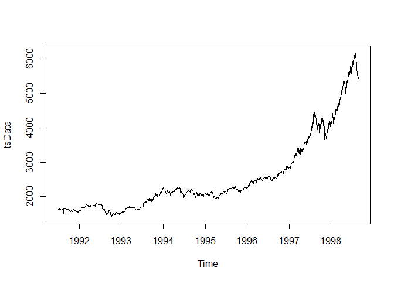
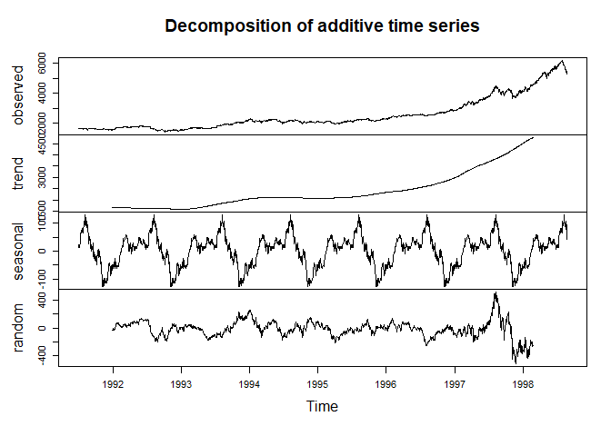
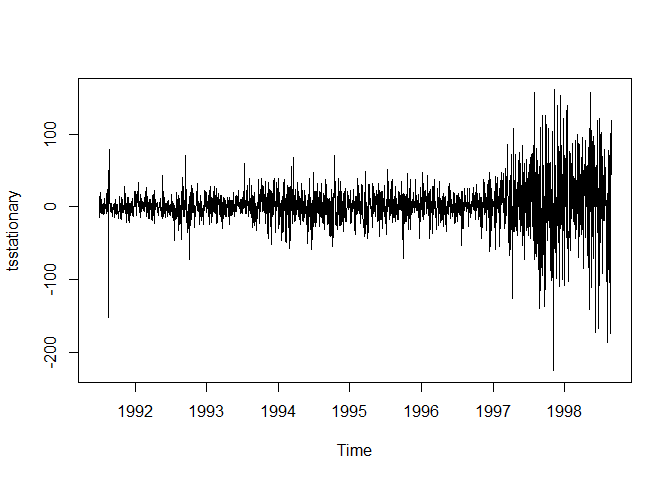
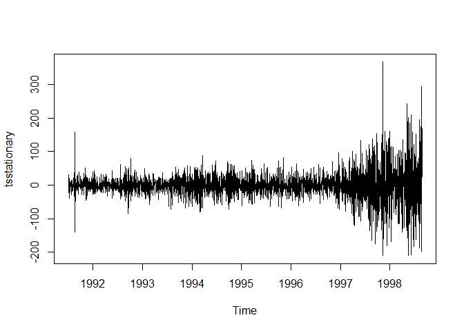
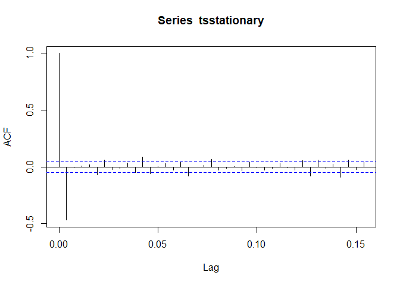
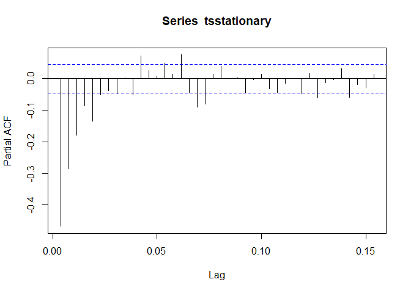
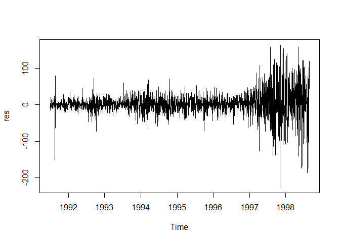
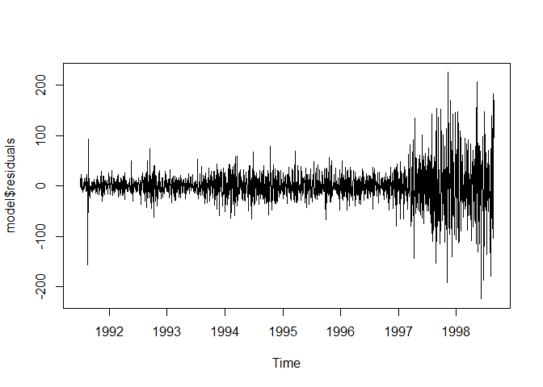
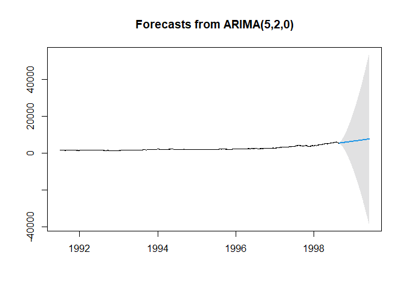

Time Series Analysis (ARIMA) with R
================
Leopoldine Mirtil

### Disclaimer

This analysis was done as part of the “Time Series Analysis (ARIMA) with
R” guided project offered on Coursera.com and taught by instructor
Barsha Saha.

### Objective

Understand the pattern of the time series data, select the best fit
model and forecast

### Load Data

``` r
data('EuStockMarkets')
```

### Convert Data to Time Series Format

<!-- -->

### ARIMA Model

#### Exploratory Analysis for Time Series Components

<!-- -->

#### Unit Root Test

    ## 
    ## ####################### 
    ## # KPSS Unit Root Test # 
    ## ####################### 
    ## 
    ## Test is of type: tau with 8 lags. 
    ## 
    ## Value of test-statistic is: 3.6982 
    ## 
    ## Critical value for a significance level of: 
    ##                 10pct  5pct 2.5pct  1pct
    ## critical values 0.119 0.146  0.176 0.216

<!-- -->

#### Remove Seasonality

<!-- -->

### Model Fit

<!-- --><!-- -->

#### Sample Test

<!-- -->

#### Best Fit Model

<!-- -->

### Forecast

<!-- -->
